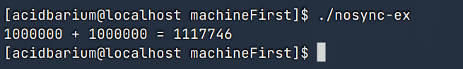

# 操作系统第一次上机报告

姓名：刘晨旭 学号：20232241110


## 1. 目标

熟悉并掌握Linux pthread编程  
熟练掌握pthread库的同步、互斥机制，并能应用来解决实际问题

## 熟悉Linux环境下pthread编程

### 完成示例代码的编译与执行：
- nosync-ex.c
- mutex-ex.c
- sem-ex.c

#### nosync-ex.c

```c
#include <stdio.h>
#include <pthread.h>

int sum = 0;

void *thread(void *arg) {
    int i;
    for (i = 0; i < 1000000; i++) {
        sum++;
    }
}

int main(void) {
    pthread_t tid1, tid2;
    pthread_create(&tid1, NULL, thread, NULL);
    pthread_create(&tid2, NULL, thread, NULL);
    pthread_join(tid1, NULL);
    pthread_join(tid2, NULL);
    printf("1000000 + 1000000 = %d\n", sum);
    return 0;
}

```

使用下面的指令来编译

```bash
gcc -o nosync-ex nosync-ex.c -lpthread
```

输入下面的指令来运行
```bash
./nosync-ex
```

运行结果如下图所示



由于这段代码有多线程对全局变量 sum 的竞态条件，导致结果不正确。

#### mutex-ex.c

代码如下

```c
#include <pthread.h>
#include <stdio.h>

int sum = 0;
pthread_mutex_t mutex;

void* thread(void*arg) {
    int i;
    for (i = 0; i < 1000000; i++) {
        pthread_mutex_lock(&mutex);
        sum++;
        pthread_mutex_unlock(&mutex);
    }
}
int main(void) {
    pthread_t tid1, tid2;

    pthread_mutex_init(&mutex, NULL);

    pthread_create(&tid1, NULL, thread, NULL);
    pthread_create(&tid2, NULL, thread, NULL);

    pthread_join(tid1, NULL);
    pthread_join(tid2, NULL);

    printf("1000000 + 1000000 = %d\n", sum);

    pthread_mutex_destroy(&mutex);
    return 0;
}

```

使用下面的指令来编译

```bash
gcc -o mutex-ex mutex-ex.c -lpthread
```

输入下面的指令来运行
```bash
./mutex-ex
```

运行结果如下图所示


这段代码用互斥锁保证了多线程对 sum 的互斥访问，避免了竞态条件，所以结果正确。


#### sem-ex.c

代码如下

```c
#include <pthread.h>
#include <semaphore.h>
#include <stdio.h>

int sum = 0;
sem_t sem;

void* thread(void*arg) {
    int i;
    for (i = 0; i < 1000000; i++) {
        sem_wait(&sem);
        sum++;
        sem_post(&sem);
    }
}

int main(void) {
    pthread_t tid1, tid2;

    sem_init(&sem, 0, 1);

    pthread_create(&tid1, NULL, thread, NULL);
    pthread_create(&tid2, NULL, thread, NULL);

    pthread_join(tid1, NULL);
    pthread_join(tid2, NULL);

    printf("1000000 + 1000000 = %d\n", sum);

    sem_destroy(&sem);
    return 0;
}

```

使用下面的指令来编译

```bash
gcc -o sem-ex sem-ex.c -lpthread
```

输入下面的指令来运行
```bash
./sem-ex
```


运行结果如下图所示


这段代码用信号量实现了对 sum 的互斥访问，避免了竞态条件，所以结果正确。


### 基于示例中涉及到的线程同步API，实现生产者消费者问题（具体的生产、消费操作可自行设计），检查时需能清楚说明程序设计思路。

编写代码如下所示
```c
#include <pthread.h>
#include <stdio.h>
#include <stdlib.h>
#include <unistd.h>
#include <time.h>
#include <semaphore.h>

int sum = 0;  

pthread_mutex_t mutex = PTHREAD_MUTEX_INITIALIZER;
sem_t not_empty;   

void* producer(void* arg) {
    while (1) {

        pthread_mutex_lock(&mutex);  
        sum++;  
        printf("Producer produced an item. Current sum: %d\n", sum);

        sem_post(&not_empty);  
        pthread_mutex_unlock(&mutex); 

        sleep(rand() % 2 + 1);  
    }

    return NULL;
}

void* consumer(void* arg) {
    while (1) {
        sem_wait(&not_empty);  

        pthread_mutex_lock(&mutex); 

        sum--;  
        printf("Consumer consumed an item. Current sum: %d\n", sum);


        pthread_mutex_unlock(&mutex);

        sleep(rand() % 2 + 2);  
    }

    return NULL;
}

int main() {
    pthread_t producers[2], consumers[2];

    srand(time(0));

    sem_init(&not_empty, 0, 0);  

    for (int i = 0; i < 2; i++) {
        pthread_create(&producers[i], NULL, producer, NULL);
        pthread_create(&consumers[i], NULL, consumer, NULL);
    }

    for (int i = 0; i < 2; i++) {
        pthread_join(producers[i], NULL);
        pthread_join(consumers[i], NULL);
    }

    sem_destroy(&not_empty);

    return 0;
}

```