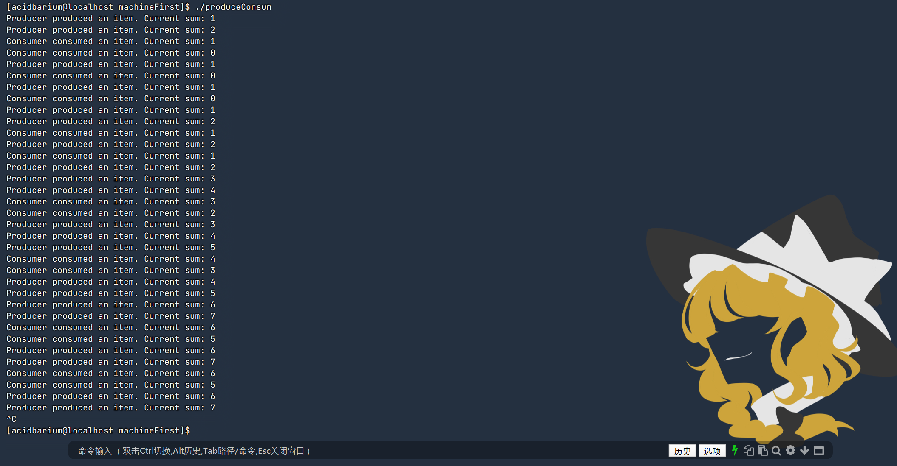

# 操作系统第一次上机报告

姓名：刘晨旭 学号：20232241110


## 1. 目标

熟悉并掌握Linux pthread编程  
熟练掌握pthread库的同步、互斥机制，并能应用来解决实际问题

## 熟悉Linux环境下pthread编程

### 完成示例代码的编译与执行：
- nosync-ex.c
- mutex-ex.c
- sem-ex.c

#### nosync-ex.c

```c
#include <stdio.h>
#include <pthread.h>

int sum = 0;

void *thread(void *arg) {
    int i;
    for (i = 0; i < 1000000; i++) {
        sum++;
    }
}

int main(void) {
    pthread_t tid1, tid2;
    pthread_create(&tid1, NULL, thread, NULL);
    pthread_create(&tid2, NULL, thread, NULL);
    pthread_join(tid1, NULL);
    pthread_join(tid2, NULL);
    printf("1000000 + 1000000 = %d\n", sum);
    return 0;
}

```

使用下面的指令来编译

```bash
gcc -o nosync-ex nosync-ex.c -lpthread
```

输入下面的指令来运行
```bash
./nosync-ex
```

运行结果如下图所示


由于这段代码有多线程对全局变量 sum 的竞态条件，导致结果不正确。

#### mutex-ex.c

代码如下

```c
#include <pthread.h>
#include <stdio.h>

int sum = 0;
pthread_mutex_t mutex;

void* thread(void*arg) {
    int i;
    for (i = 0; i < 1000000; i++) {
        pthread_mutex_lock(&mutex);
        sum++;
        pthread_mutex_unlock(&mutex);
    }
}
int main(void) {
    pthread_t tid1, tid2;

    pthread_mutex_init(&mutex, NULL);

    pthread_create(&tid1, NULL, thread, NULL);
    pthread_create(&tid2, NULL, thread, NULL);

    pthread_join(tid1, NULL);
    pthread_join(tid2, NULL);

    printf("1000000 + 1000000 = %d\n", sum);

    pthread_mutex_destroy(&mutex);
    return 0;
}

```

使用下面的指令来编译

```bash
gcc -o mutex-ex mutex-ex.c -lpthread
```

输入下面的指令来运行
```bash
./mutex-ex
```

运行结果如下图所示


这段代码用互斥锁保证了多线程对 sum 的互斥访问，避免了竞态条件，所以结果正确。


#### sem-ex.c

代码如下

```c
#include <pthread.h>
#include <semaphore.h>
#include <stdio.h>

int sum = 0;
sem_t sem;

void* thread(void*arg) {
    int i;
    for (i = 0; i < 1000000; i++) {
        sem_wait(&sem);
        sum++;
        sem_post(&sem);
    }
}

int main(void) {
    pthread_t tid1, tid2;

    sem_init(&sem, 0, 1);

    pthread_create(&tid1, NULL, thread, NULL);
    pthread_create(&tid2, NULL, thread, NULL);

    pthread_join(tid1, NULL);
    pthread_join(tid2, NULL);

    printf("1000000 + 1000000 = %d\n", sum);

    sem_destroy(&sem);
    return 0;
}

```

使用下面的指令来编译

```bash
gcc -o sem-ex sem-ex.c -lpthread
```

输入下面的指令来运行
```bash
./sem-ex
```


运行结果如下图所示


这段代码用信号量实现了对 sum 的互斥访问，避免了竞态条件，所以结果正确。


### 基于示例中涉及到的线程同步API，实现生产者消费者问题（具体的生产、消费操作可自行设计），检查时需能清楚说明程序设计思路。

编写代码如下所示
```c
#include <pthread.h>
#include <stdio.h>
#include <stdlib.h>
#include <unistd.h>
#include <time.h>
#include <semaphore.h>

int sum = 0;  

pthread_mutex_t mutex = PTHREAD_MUTEX_INITIALIZER;
sem_t not_empty;   

void* producer(void* arg) {
    while (1) {

        pthread_mutex_lock(&mutex);  
        sum++;  
        printf("Producer produced an item. Current sum: %d\n", sum);

        sem_post(&not_empty);  
        pthread_mutex_unlock(&mutex); 

        sleep(rand() % 2 + 1);  
    }

    return NULL;
}

void* consumer(void* arg) {
    while (1) {
        sem_wait(&not_empty);  

        pthread_mutex_lock(&mutex); 

        sum--;  
        printf("Consumer consumed an item. Current sum: %d\n", sum);


        pthread_mutex_unlock(&mutex);

        sleep(rand() % 2 + 2);  
    }

    return NULL;
}

int main() {
    pthread_t producers[2], consumers[2];

    srand(time(0));

    sem_init(&not_empty, 0, 0);  

    for (int i = 0; i < 2; i++) {
        pthread_create(&producers[i], NULL, producer, NULL);
        pthread_create(&consumers[i], NULL, consumer, NULL);
    }

    for (int i = 0; i < 2; i++) {
        pthread_join(producers[i], NULL);
        pthread_join(consumers[i], NULL);
    }

    sem_destroy(&not_empty);

    return 0;
}

```

**主线程初始化:**
> 初始化互斥锁和信号量，创建 2 个生产者线程和 2 个消费者线程。

**生产者线程流程：**

> 加锁，sum++ 表示生产一个物品。
> 打印当前 sum。
> sem_post 增加信号量，通知有物品可消费。
> 解锁，随机休眠 1~2 秒。

**消费者线程流程：**

> sem_wait 等待信号量，确保有物品可消费。
> 加锁，sum-- 表示消费一个物品。
> 打印当前 sum。
> 解锁，随机休眠 2~3 秒。


使用下面的指令来编译

```bash
gcc -o produceConsum produceConsum.c -lpthread
```

输入下面的指令来运行
```bash
./produceConsum
```

运行结果如下图所示



## 代码阅读

### pthread-ex01

```c
#include <stdio.h> 
#include <pthread.h> 

void *thread(void *vargp) { 
    pthread_exit((void *)42); 
} 

int main(){ 
    int i; 
    pthread_t tid; 
    pthread_create(&tid, NULL, thread, NULL); 
    pthread_join(tid, (void **)&i); 
    printf ("%d\n", i); 
    return 0; 
}
```

**代码理解**
>主线程创建一个子线程，子线程运行后立即退出并返回 42，主线程通过 pthread_join 获取该返回值，并将其输出。

### pthread-ex02
```c
#include <stdio.h> 
#include <stdlib.h> 
#include <pthread.h> 

void *thread(void *vargp) { 
    exit(42); 
} 

int main(){ 
    int i; 
    pthread_t tid; 
    pthread_create(&tid, NULL, thread, NULL); 
    pthread_join(tid, (void **)&i); 
    printf ("%d\n", i); 
    return 0; 
}
```

**代码理解**

> 该程序创建一个子线程，子线程在执行过程中调用 exit(42) 直接终止整个进程，导致主线程无法正常回收子线程的返回值,最终无法printf输出。

### pthread-ex03

```c
#include <stdio.h> 
#include <pthread.h> 

void *thread(void *vargp) { 
    int *ptr = (int*)vargp; 
    pthread_exit((void*)*ptr); 
} 

void *thread2(void *vargp) { 
    int *ptr = (int*)vargp; 
    *ptr = 0; 
    pthread_exit((void*)31); 
} 

int main() { 
    int i = 42; 
    pthread_t tid, tid2; 
    pthread_create(&tid, NULL, thread, (void*)&i); 
    pthread_create(&tid2, NULL, thread2, (void*)&i); 
    pthread_join(tid, (void**)&i); 
    pthread_join(tid2, NULL); 
    printf("%d\n",i); 
}
```

**代码理解**

> 该程序创建了两个线程，其中第一个线程将传入的整数指针所指向的值作为返回值退出，而第二个线程修改了该整数值并退出；主线程在回收第一个线程时获取了该整数值作为返回值，最终打印该值。


### pthread-ex-04

```c
#include <stdio.h> 
#include <stdlib.h> 
#include <pthread.h> 

void *thread(void *vargp) { 
    pthread_detach(pthread_self()); 
    pthread_exit((void*)42); 
}

int main() { 
    int i = 0; 
    pthread_t tid; 
    pthread_create(&tid, NULL, thread, (void*)&i); 
    pthread_join(tid, (void**)&i); 
    printf("%d\n",i); 
}
```

**代码理解**

> 由于未能正确回收子线程的返回值，i 的值无法预期，可能导致程序输出不确定的值或者程序崩溃。

### pthread-ex-05

```c
#include <stdio.h> 
#include <pthread.h> 

int i = 42; 

void *thread(void *vargp) { 
    printf("%d\n",i); 
} 

void *thread2(void *vargp) { 
    i = 31; 
} 

int main() { 
    pthread_t tid, tid2; 
    pthread_create(&tid2, NULL, thread2, (void*)&i); 
    pthread_create(&tid, NULL, thread, (void*)&i); 
    pthread_join(tid, (void**)&i); 
    pthread_join(tid2, NULL); 
}
```

**代码理解**
> 该程序创建了两个线程，其中第一个线程打印全局变量 i 的值，第二个线程修改该变量的值；主线程等待两个子线程完成，但由于线程执行的并发性，i 的最终值在不同的执行情况下可能不同。

### pthread-ex-06

```c
#include <stdio.h> 
#include <stdlib.h> 
#include <pthread.h> 

void *foo(void *vargp) { 
    int myid; 
    myid = *((int *)vargp); 
    free(vargp); 
    printf("Thread %d\n", myid); 
} 

int main() { 
    pthread_t tid[2]; 
    int i, *ptr; 
    for (i = 0; i < 2; i++) { 
        ptr = malloc(sizeof(int)); 
        *ptr = i; 
        pthread_create(&tid[i], 0, foo, ptr); 
    } 
    pthread_join(tid[0], 0); 
    pthread_join(tid[1], 0); 
}
```

**代码理解**
> 该程序创建了两个线程，每个线程接收一个动态分配的内存（包含线程编号），在执行时打印线程编号并释放该内存；主线程等待两个子线程完成后退出。

### pthread-ex-07

```c
#include <stdio.h> 
#include <stdlib.h> 
#include <pthread.h> 

void *foo(void *vargp) { 
    int myid; 
    myid = *((int *)vargp); 
    printf("Thread %d\n", myid); 
} 

int main() { 
    pthread_t tid[2]; 
    int i; 
    for (i = 0; i < 2; i++) { 
        pthread_create(&tid[i], 0, foo, &i); 
    } 
    pthread_join(tid[0], 0); 
    pthread_join(tid[1], 0); 
}
```

**代码理解**
> 由于访问冲突和访问时间问题，输出可能会出现不可预测的结果。例如，两个线程可能都打印 Thread 1，因为它们都读取到了相同的 i 值；如果两个线程都稍微慢一些，有可能都输出2。