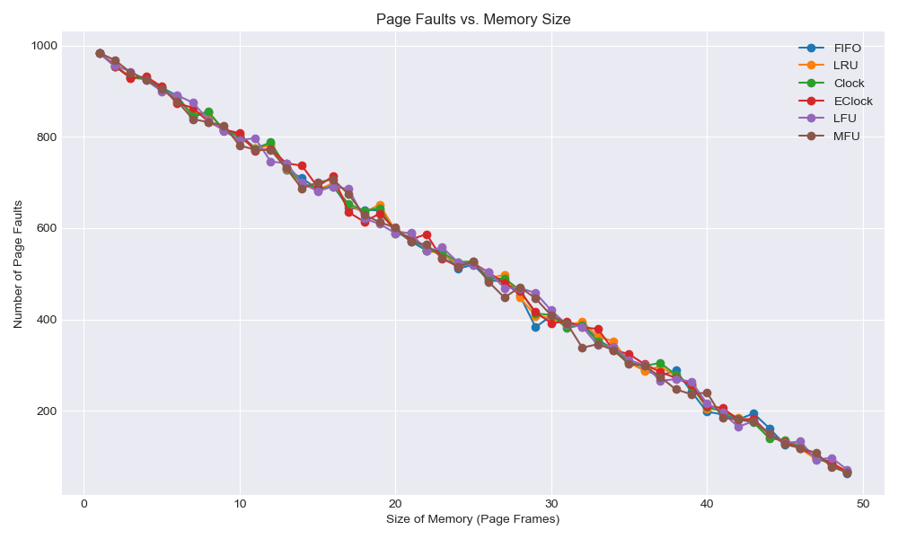

# 操作系统第四次上机报告

姓名：刘晨旭 学号：20232241110 班级：软件2306

仓库地址：https://github.com/AcidBarium/osHomework

## 实验目的

本实验旨在加深学生对虚拟存储器及存储管理原理的理解，通过模拟页面置换算法（如LRU和FIFO），观察其置换过程，掌握编程技巧，并分析实验数据以比较不同算法的性能。实验要求学生测试不同引用串和内存帧数的组合，绘制缺页数曲线图，并综合分析算法适应性，从而写出实验报告。

## 实验过程

- 创建文件：新建vmrp.h和vmrp.cc文件，用于声明和定义虚拟内存页置换类及其相关算法函数。
- 编写程序代码：
> 在vmrp.h文件中，声明虚拟内存页置换类Replace，包括页面置换算法相关的函数，如InitSpace、Report、Fifo、Lru等。
在vmrp.cc文件中，实现类的构造函数、析构函数、InitSpace函数用于初始化页号记录，Report函数用于报告算法执行情况，以及Fifo和Lru函数分别实现先进先出和最近最久未用置换算法。

- 创建Makefile文件：用于编译和链接程序代码，生成可执行文件vmpr。
- 编译程序：通过执行make命令，按照Makefile文件中的规则编译vmrp.cc文件，生成目标文件vmrp.o，再将其链接生成可执行文件vmpr。
- 测试程序:运行可执行文件vmpr，输入相应的页面引用串和内存帧数。

## 实验代码以及详细解释

### Clock

```cpp
void Replace::Clock(void) // 循环扫描，找到 used=false 的页面淘汰，否则把 used 清 0。
{
    InitSpace("Clock");
    int pointer = 0;                    // 指向下一个要替换的页面
    bool *used = new bool[FrameNumber]; // 用于记录页面是否被访问过
    int eliminateIndex = 0;             // 用于记录淘汰页的索引

    for (int i = 0; i < FrameNumber; i++)
    {
        used[i] = false;
    }

    for (int k = 0; k < PageNumber; k++)
    {
        int next = ReferencePage[k];
        bool found = false;

        // 检查页面是否在帧中
        for (int i = 0; i < FrameNumber; i++)
        {
            if (PageFrames[i] == next)
            {
                found = true;
                used[i] = true; // 将页面标记为已访问
                break;
            }
        }

        if (!found)
        {
            FaultNumber++;
            // 找到一个没有被访问过的页面进行替换
            while (used[pointer])
            {
                used[pointer] = false;
                pointer = (pointer + 1) % FrameNumber;
            }

            // 记录被淘汰的页面
            if (PageFrames[pointer] != -1)
            {
                EliminatePage[eliminateIndex++] = PageFrames[pointer];
            }

            // 进行页面替换
            PageFrames[pointer] = next;
            used[pointer] = true;
            pointer = (pointer + 1) % FrameNumber;
        }

        // 报告当前实存中页号
        for (int j = 0; j < FrameNumber; j++)
        {
            if (PageFrames[j] >= 0)
                cout << PageFrames[j] << " ";
        }
        if (!found && eliminateIndex > 0 &&
            EliminatePage[eliminateIndex - 1] > 0)
            cout << "->" << EliminatePage[eliminateIndex - 1] << endl;
        else
            cout << endl;
    }

    delete[] used;
    Report();
}
```


一种近似 LRU 的算法。每个页面有个 `used` 标志位：

* 页面命中：`used=1`
* 缺页时：

  * 顺时针找 `used=0` 的页面淘汰
  * 如果 `used=1`，先清 0，继续找
  * 找到 `used=0` 就替换，`used=1`


**优点**
简单高效 只需维护一个 used 位，遍历少量内存页，算法结构清晰易实现。
性能较好	接近 LRU (最近最少使用)，但不需要复杂时间戳或链表，减少系统开销。
低额外空间开销	每个页框只需多一个 used 位，无需额外记录访问顺序。
适合实时或嵌入式系统	算法稳定、可预测、实现简单，非常适合对资源敏感的系统。
公平性	通过循环扫描，所有页都有机会被访问到，避免某些页长期驻留内存。

**适用**

- 操作系统内核级虚拟内存管理
大多数现代操作系统（如 Linux、Windows）虚拟内存管理器中，都会以 Clock 算法或其改进版本 (如 Enhanced Clock / Nth Chance Clock) 作为缺页置换算法。

- 实时操作系统 (RTOS)
实时性和确定性强、资源有限的场景中，Clock 算法以其稳定性和可控性受到青睐。

- 嵌入式设备中的缓存或页面管理
嵌入式环境中，内存受限、对复杂算法支持有限，Clock 算法能提供良好平衡。

- 高性能数据库或缓存替换策略
某些数据库系统 (如 PostgreSQL) 也使用 Clock 算法变种管理缓存页。


### Eclock

```cpp
void Replace::Eclock(void) // 在 Clock 基础上，考虑 used 和 modified，优先淘汰 used=0, modified=0 的。
{
    InitSpace("EClock");
    int pointer = 0;                        // 指向下一个要替换的页面
    bool *used = new bool[FrameNumber];     // 用于记录页面是否被访问过
    bool *modified = new bool[FrameNumber]; // 用于记录页面是否被修改过
    int eliminateIndex = 0;                 // 用于记录淘汰页的索引

    for (int i = 0; i < FrameNumber; i++)
    {
        used[i] = false;
        modified[i] = false;
    }

    for (int k = 0; k < PageNumber; k++)
    {
        int next = ReferencePage[k];
        bool found = false;

        // 检查页面是否在帧中
        for (int i = 0; i < FrameNumber; i++)
        {
            if (PageFrames[i] == next)
            {
                found = true;
                used[i] = true;     // 将页面标记为已访问
                modified[i] = true; // 假设页面被访问时也被修改
                break;
            }
        }

        if (!found)
        {
            FaultNumber++;
            // 找到一个没有被访问过的页面进行替换
            //  0 0 立即替换

            int zeroOne = -1;

            int pointerTemp = pointer;
            pointerTemp++;
            pointerTemp %= FrameNumber;

            bool isHaveZeroZero = false;

            while (pointerTemp != pointer) // 先找一圈有没有00
            {
                if (used[pointerTemp] == false && modified[pointerTemp] == false)
                {
                    isHaveZeroZero = true;
                    break;
                }
                pointerTemp = (pointerTemp + 1) % FrameNumber;
            }

            if (used[pointer] == false && modified[pointer] == false)
            {
                isHaveZeroZero = true;
            }

            if (isHaveZeroZero)
            {
                while (1)
                {
                    if (used[pointer] == false && modified[pointer] == false)
                    {
                        // 00情况：直接置换
                        break;
                    }
                    else if (used[pointer] == false && modified[pointer] == true)
                    {
                    }
                    else if (used[pointer] == true && modified[pointer] == false)
                    {
                        // 10情况：R清0
                        used[pointer] = 0;
                    }
                    else if (used[pointer] == true && modified[pointer] == true)
                    {
                        // 11情况：R清0
                        used[pointer] = 0;
                    }
                    // 循环下一个
                    pointer = (pointer + 1) % FrameNumber;
                }
            }
            else
            {
                while (1)
                {
                    if (used[pointer] == false && modified[pointer] == false)
                    {
                        // 00情况：直接置换
                        break;
                    }
                    else if (used[pointer] == false && modified[pointer] == true)
                    {
                        break;
                    }
                    else if (used[pointer] == true && modified[pointer] == false)
                    {
                        // 10情况：R清0
                        used[pointer] = 0;
                    }
                    else if (used[pointer] == true && modified[pointer] == true)
                    {
                        // 11情况：R清0
                        used[pointer] = 0;
                    }

                    // 循环下一个
                    pointer = (pointer + 1) % FrameNumber;
                }
            }

            // 记录被淘汰的页面
            if (PageFrames[pointer] != -1)
            {
                EliminatePage[eliminateIndex++] = PageFrames[pointer];
            }

            // 进行页面替换
            PageFrames[pointer] = next;
            used[pointer] = true;
            modified[pointer] = false; // 新页面假设未被修改
            pointer = (pointer + 1) % FrameNumber;
        }

        // 报告当前实存中页号
        for (int j = 0; j < FrameNumber; j++)
        {
            if (PageFrames[j] >= 0)
                cout << PageFrames[j] << " ";
        }
        if (!found && eliminateIndex > 0 &&
            EliminatePage[eliminateIndex - 1] > 0)
            cout << "->" << EliminatePage[eliminateIndex - 1] << endl;
        else
            cout << endl;
    }

    delete[] used;
    delete[] modified;
    Report();
}
```


**EClock (Enhanced Clock) 算法**是对普通 Clock 算法的改进版，**在基本的 `used` (访问标志位) 基础上，额外引入了 `modified` (修改标志位)**，实现更细致的页面淘汰优先级判定。

#### 算法核心逻辑：

**每个内存页框（Page Frame）维护两个状态位**：

* `used`：是否被访问过
* `modified`：是否被修改过（本实现中，假设页面每次访问即视为被修改）

####  页面淘汰优先级：

1. **优先淘汰 `used=0` 且 `modified=0` 的页面** —— 代表**既没被访问过也没被修改过**，直接替换，最优。
2. 如果没有 `00` 页面，再寻找 `used=0, modified=1` 的页面 —— 虽然被修改过，但长期未被访问，需要写回磁盘后淘汰。
3. 如果仍未找到合适页面，继续将 `used=1` 的页面逐个将 `used` 清零，再继续扫描，直到找到 00 或 01。

#### 算法执行过程：

1. **页面命中时**

   * 将对应页的 `used` 和 `modified` 位置为 1。

2. **缺页时**

   * 先遍历一圈判断是否存在 `used=0, modified=0` 的页面。
   * 如果存在，按优先级直接置换。
   * 如果没有：

     * 第一圈内将 `used=1` 的页面置0。
     * 第二圈开始再执行优先级判断。

3. **置换完成后**

   * 被淘汰页面记录入 `EliminatePage` 数组。
   * 新调入页面的 `used=1, modified=0`，假设新页尚未被修改。


### 特别注意：

* **寻找是否存在 00 页面**时，先做一圈无修改的快速扫描判断。
* **正式选择替换页**过程中，才逐个修改 `used` 位。
* 这样既保证替换优先级，又避免不必要的 `used` 修改，提升性能。


**优点**

综合性能优异	同时兼顾了页面访问频率（used）和写入代价（modified），性能优于单纯的 Clock 和 LRU。
减少 I/O 开销	优先淘汰未修改页，减少将脏页写回磁盘的次数，降低 I/O 代价，提升系统整体效率。
接近理想 LRU+最少写回策略	通过分类淘汰顺序，尽量模拟“最近最少使用+尽量不写磁盘”的理想策略。
维护开销小	只需要两个标志位，结构简单，开销远低于完整 LRU 或 NFU 算法。
高扩展性	可以轻松扩展成 Nth Chance Clock，或者 Linux 的双链表 active/inactive 页框管理。

**适用**

- 操作系统虚拟内存管理
例如：早期 UNIX、Linux、Windows 虚拟内存管理器，尤其在磁盘 I/O 昂贵的环境中，EClock 可显著提升性能。

- 数据库缓存管理
数据库缓存池（Buffer Pool）中，脏页写回磁盘代价高，EClock 能有效平衡缓存页命中率和写回开销。

- 嵌入式和实时系统
对内存访问可控性强、I/O 敏感，EClock 简单高效，兼顾访问局部性和写回次数，适合资源受限系统。

- 存储系统缓存策略
如 SSD 控制器、对象存储缓存，优先淘汰未修改数据，延迟写回脏数据，提升读写效率和设备寿命。


### Lfu
```cpp
void Replace::Lfu(void) // 淘汰使用频率最少的页面。
{
    InitSpace("LFU");
    int *frequency = new int[FrameNumber]; // 记录每个页面的使用频率
    int eliminateIndex = 0;                // 用于记录淘汰页的索引

    for (int i = 0; i < FrameNumber; i++)
    {
        frequency[i] = 0;
    }

    for (int k = 0; k < PageNumber; k++)
    {
        int next = ReferencePage[k];
        bool found = false;

        // 检查页面是否在帧中
        for (int i = 0; i < FrameNumber; i++)
        {
            if (PageFrames[i] == next)
            {
                found = true;
                frequency[i]++; // 增加页面的使用频率
                break;
            }
        }

        if (!found)
        {
            FaultNumber++;
            // 找到使用频率最低的页面进行替换
            int minFreqIndex = 0;
            for (int i = 1; i < FrameNumber; i++)
            {
                if (frequency[i] < frequency[minFreqIndex])
                {
                    minFreqIndex = i;
                }
            }

            // 记录被淘汰的页面
            if (PageFrames[minFreqIndex] != -1)
            {
                EliminatePage[eliminateIndex++] = PageFrames[minFreqIndex];
            }

            // 进行页面替换
            PageFrames[minFreqIndex] = next;
            frequency[minFreqIndex] = 1; // 新页面初始使用频率为1
        }

        // 报告当前实存中页号
        for (int j = 0; j < FrameNumber; j++)
        {
            if (PageFrames[j] >= 0)
                cout << PageFrames[j] << " ";
        }
        if (!found && eliminateIndex > 0 &&
            EliminatePage[eliminateIndex - 1] > 0)
            cout << "->" << EliminatePage[eliminateIndex - 1] << endl;
        else
            cout << endl;
    }

    delete[] frequency;
    Report();
}
```

**LFU (Least Frequently Used) 页面置换算法**
每次缺页，淘汰**访问频率最低**的页面。页面命中时频率+1，缺页时替换频率最小者，新页频率初始化为 1。

**优点**
优先保留高频使用页面	高频访问的页面会留下，减少再次缺页概率，命中率高。
适合稳定热点场景	访问频率差异明显的场景，LFU 能很好体现局部性。
简单直观，易于实现	每个页框只需维护一个整数频率，无复杂链表或队列结构。
命中率表现优于 FIFO 和简单 Clock	特别在访问频率不均匀时效果明显。


**缺点**	
不适合访问模式突变	如果热点页面突然变化，旧高频页面不容易淘汰（称“幽灵页”问题）。
老页面长期频率高	无衰减机制时，旧高频页长期驻留，阻碍新热点页加入。
频率维护开销	虽然简单，但频率数值累积增长，极端情况可能导致溢出或需要定期归一化。

**适用**

- 嵌入式设备缓存
小型嵌入式系统中，缓存空间有限但访问模式稳定，LFU 能保证常用数据常驻内存。

- Web 缓存/CDN 节点
访问热点集中，静态资源访问频率差距明显，LFU 能保证高频资源驻留，减少回源次数。

- 数据库缓冲池
事务型或查询型数据库里，部分数据表、索引页访问频繁，LFU 保证这些页优先留在内存。

- 数据流缓冲
IoT、视频流等数据缓存场景，热点数据稳定，LFU 能显著降低缓存缺页率。

### Mfu

```cpp
void Replace::Mfu(void) // 淘汰使用频率最多的页面。
{
    InitSpace("MFU");
    int *frequency = new int[FrameNumber]; // 记录每个页面的使用频率
    int eliminateIndex = 0;                // 用于记录淘汰页的索引
    int cnt = 0;

    for (int i = 0; i < FrameNumber; i++)
    {
        frequency[i] = 0;
    }

    for (int k = 0; k < PageNumber; k++)
    {
        int next = ReferencePage[k];
        bool found = false;

        // 检查页面是否在帧中
        for (int i = 0; i < FrameNumber; i++)
        {
            if (PageFrames[i] == next)
            {
                found = true;
                frequency[i]++; // 增加页面的使用频率
                break;
            }
        }

        if (!found && cnt < FrameNumber)
        {
            FaultNumber++;
            PageFrames[cnt] = next;
            frequency[cnt] = 0; // 新页面初始使用频率为0

            if (PageFrames[cnt] != -1)
            {
                EliminatePage[eliminateIndex++] = PageFrames[cnt];
            }

            cnt++;
        }
        else if (!found)
        {
            FaultNumber++;
            // 找到使用频率最高的页面进行替换
            int maxFreqIndex = 0;
            for (int i = 1; i < FrameNumber; i++)
            {
                if (frequency[i] >= frequency[maxFreqIndex])
                {
                    maxFreqIndex = i;
                }
            }

            // 记录被淘汰的页面
            if (PageFrames[maxFreqIndex] != -1)
            {
                EliminatePage[eliminateIndex++] = PageFrames[maxFreqIndex];
            }

            // 进行页面替换
            PageFrames[maxFreqIndex] = next;
            frequency[maxFreqIndex] = 0; // 新页面初始使用频率为0
        }

        // 报告当前实存中页号
        for (int j = 0; j < FrameNumber; j++)
        {
            if (PageFrames[j] >= 0)
                cout << PageFrames[j] << " ";
        }
        if (!found && eliminateIndex > 0 &&
            EliminatePage[eliminateIndex - 1] > 0)
            cout << "->" << EliminatePage[eliminateIndex - 1] << endl;
        else
            cout << endl;
    }

    delete[] frequency;
    Report();
}
```

**策略**：缺页时淘汰**访问频率最高**的页面。

**实现细节**：

* 初始化 `frequency[i]=0`，`cnt=0` 表示当前占用帧数。
* 每次访问：

  1. 若页面命中，频率+1。
  2. 若缺页：

     * 若有空帧 (`cnt < FrameNumber`)，直接放入，频率设0，`cnt++`。
     * 否则，找**频率最大**的帧（相等取后者），淘汰，放入新页，频率设0。
* 实时输出当前帧内容，记录淘汰页。


**优点**
结构简单，易于实现	只需维护频率计数数组，无复杂链表或队列。
适合某些极端场景	比如有页面长时间频繁访问，过热资源可能导致系统拥塞，适合主动清理。
和 LFU 配对做对照测试	常用于与 LFU 对照验证算法优劣，或用于模拟特殊缓存策略。

**缺点**	
违背局部性原理	局部性原理认为近期高频页面未来仍可能被用到，MFU 正好反着来，通常命中率较低。
适用场景有限	绝大多数程序的访问模式遵循局部性，MFU 适用面较窄。
高频页面容易被误杀	高频常用页被频繁清除，可能导致频繁缺页，增加 I/O。

**适用**

- 防缓存击穿
极个别资源被大量访问（过热数据）时，故意清除高频页，缓和系统压力。

- 实验验证对照
算法课程、系统模拟、缓存机制研究里常用 MFU 和 LFU 做对照试验。

- 特殊策略缓存
部分负载均衡策略或资源抢占型缓存，可能用 MFU 保证资源轮换。


## 实验结果如下所示

输入数据为
```bash
12
1 2 3 4 1 2 5 1 2 3 4 5
3
```

```bash
FIFO
1 
1 2 
1 2 3 
4 2 3 ->1
4 1 3 ->2
4 1 2 ->3
5 1 2 ->4
5 1 2 
5 1 2 
5 3 2 ->1
5 3 4 ->2
5 3 4 

Eliminate page:1 2 3 4 1 2 
Number of page faults = 9
Rate of page faults = 75%

LRU
1 
2 1 
3 2 1 
4 3 2 ->1
1 4 3 ->2
2 1 4 ->3
5 2 1 ->4
1 5 2 
2 1 5 
3 2 1 ->5
4 3 2 ->1
5 4 3 ->2

Eliminate page:1 2 3 4 5 1 2 
Number of page faults = 10
Rate of page faults = 83.3%

Clock
1 
1 2 
1 2 3 
4 2 3 ->1
4 1 3 ->2
4 1 2 ->3
5 1 2 ->4
5 1 2 
5 1 2 
5 3 2 ->1
5 3 4 ->2
5 3 4 

Eliminate page:1 2 3 4 1 2 
Number of page faults = 9
Rate of page faults = 75%

EClock
1 
1 2 
1 2 3 
4 2 3 ->1
4 1 3 ->2
4 1 2 ->3
5 1 2 ->4
5 1 2 
5 1 2 
5 3 2 ->1
4 3 2 ->5
4 3 5 ->2

Eliminate page:1 2 3 4 1 5 2 
Number of page faults = 10
Rate of page faults = 83.3%

LFU
1 
1 2 
1 2 3 
4 2 3 ->1
1 2 3 ->4
1 2 3 
5 2 3 ->1
1 2 3 ->5
1 2 3 
1 2 3 
4 2 3 ->1
5 2 3 ->4

Eliminate page:1 4 1 5 1 4 
Number of page faults = 9
Rate of page faults = 75%

MFU
1 
1 2 
1 2 3 
1 2 4 ->3
1 2 4 
1 2 4 
1 5 4 ->2
1 5 4 
2 5 4 ->1
2 5 3 ->4
2 5 4 ->3
2 5 4 

Eliminate page:1 2 3 3 2 1 4 3 
Number of page faults = 8
Rate of page faults = 66.7%
```
可以看出

在有局部性参考串+小内存帧数时，
- MFU 可能反常发挥
- LRU 未必最好
- EClock 也不一定更优


## 编写py程序批量处理并画图

```py
import subprocess
import random
import pandas as pd
import re
import pandas as pd
import matplotlib.pyplot as plt

# 定义算法名称
methods = ['FIFO', 'LRU', 'Clock', 'EClock', 'LFU', 'MFU']

# 结果字典，key是方法，value是每个sizeOfMemory下的page fault数量列表
results = {method: [] for method in methods}

# 设定总页数
total_num = 1000

# 横坐标：sizeOfMemory 1~10
size_range = range(1, 50)

# 遍历不同sizeOfMemory
for sizeOfMemory in size_range:
    # 构造输入内容
    inputs = [str(total_num)]
    random_numbers = [str(random.randint(1, 50)) for _ in range(total_num)]
    inputs.extend(random_numbers)
    inputs.append(str(sizeOfMemory))
    input_str = '\n'.join(inputs) + '\n'

    # 运行程序
    process = subprocess.Popen(
        ['./vmrp.exe'],
        stdin=subprocess.PIPE,
        stdout=subprocess.PIPE,
        stderr=subprocess.PIPE,
        text=True
    )

    ans_ori, err = process.communicate(input=input_str)

    # 从输出中用正则提取每个方法的Number of page faults
    for method in methods:
        pattern = rf"{method}.*?Number of page faults = (\d+)"
        match = re.search(pattern, ans_ori, re.DOTALL)
        if match:
            faults = int(match.group(1))
        else:
            faults = None  # 如果没匹配到，记录None
        results[method].append(faults)

# 把结果转成DataFrame，index是sizeOfMemory
df = pd.DataFrame(results, index=size_range)
df.index.name = 'Size of Memory'

# 写入Excel
df.to_excel('result.xlsx')

print("✅ 数据已保存到 result.xlsx！")


# 读取Excel文件
df = pd.read_excel('result.xlsx', index_col=0)

# 设置绘图风格
plt.style.use('seaborn-v0_8-darkgrid')

# 创建图形和坐标轴
plt.figure(figsize=(10, 6))

# 遍历每个方法，画一条折线
for column in df.columns:
    plt.plot(df.index, df[column], marker='o', label=column)

# 设置标题和坐标轴标签
plt.title('Page Faults vs. Memory Size')
plt.xlabel('Size of Memory (Page Frames)')
plt.ylabel('Number of Page Faults')

# 显示图例
plt.legend()

# 显示图形
plt.tight_layout()
plt.show()
```

作图如下所示



上图展示了在随机串长度为1000，数据范围在1-50的情况下，不同方法的缺页数和帧数的关系。由图可以看出随机串下差别不大。


## 心得体会

通过本次实验，我更加深入理解了虚拟存储管理中各种页面置换算法的实现原理与适用场景。不同算法在面对相同引用串和帧数时，缺页率差异明显，体现了算法策略对系统性能的影响。尤其是 Clock 和 LFU 算法，通过简单标志位或计数方式，能够较好地权衡性能与实现复杂度。实践过程中也提升了自己 C++ 类与数据结构操作的熟练度，对 Makefile 工具链配置和调试流程有了更清晰的掌握。
