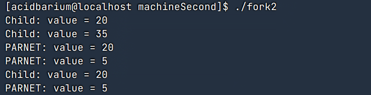

# 操作系统第二次上机报告

姓名：刘晨旭 学号：20232241110 班级：软件2306

## 实验目的

* 理解 Linux 中 `fork()` 函数的用法与进程创建机制。
* 学习管道（pipe）实现父子进程间的双向通信。
* 实践多进程协作计算任务。


## 实验内容

### 1 fork() 函数创建进程

编写 `fork.c` 文件，观察 `fork()` 创建子进程的效果，理解全局变量与局部变量在进程间的关系。

### 2 双向管道通信

通过两个管道实现父子进程之间的数据传递，掌握 `read()` 阻塞特性，理解进程同步机制。

### 3 多进程计算递归函数

实现三个进程，分别计算阶乘和斐波那契数列，并汇总结果，体验多进程协作计算。


## 1、阅读文档Linux中fork()函数详解，了解如何编程实现进程创建。 输入代码并观察、解释输出结果。 fork1.c，看注释思考问题

编写`fork.c`文件如下所示

```c
#include <sys/types.h>
#include <stdio.h>
//#include <unistd.h>
#include <stdlib.h>

int value=5;     //where?

int main(){
	
	int i;     //where?
	
	pid_t pid;
	
	for(i=0;i<2;i++){    // How many new processes and printfs£¿
		
	
		pid=fork();
	
		if(pid==0){
			value += 15;
			printf("Child: value = %d\n",value);
		}
		else if(pid>0){
			wait(NULL);
			printf("PARNET: value = %d\n",value);
			exit(0);   //Notice£ºWhat will happen with or without this line?
		}
	}
}

```

### 关于 `value` 和 `i`

* `value`：全局变量，作用域为整个文件，生命周期贯穿程序始终。子进程 `fork()` 后会复制父进程的 `value` 值，互不影响。
* `i`：局部变量，作用域仅限 `main()` 函数。

### 在有exit的时候

程序运行会按下图所示运行


从图上可以看出共输出四次，运行结果如下图所示


### 在没有exit的时候

程序会按下图所示运行


从图上可以看出共输出六次，运行结果如下图所示



## 2、ppipe.c

```c
#include <stdio.h>
#include <unistd.h>
#include <stdlib.h>

int main(int argc, char *argv[]) {
    int pid;
    int pipe1[2];    //父进程写入，子进程读取   1写 0读
    int pipe2[2];    //子进程写入，父进程读取

    int x;

    if (pipe(pipe1) < 0) {
        perror("failed to create pipe1");
        exit(EXIT_FAILURE);
    }
    if (pipe(pipe2) < 0) {
        perror("failed to create pipe2");
        exit(EXIT_FAILURE);
    }

    pid = fork();     // fork() 返回 0 表示子进程，返回正值表示父进程
    if (pid < 0) {
        perror("failed to create new process");
        exit(EXIT_FAILURE);
    } else if (pid == 0) {
        // 子进程=>父进程：子进程通过pipe2[1]写
        // 子进程<=父进程：子进程通过pipe1[0]读
        // 因此，在子进程中将pipe1[1]和pipe2[0]关闭
        close(pipe1[1]);     
        close(pipe2[0]);

        do {
            read(pipe1[0], &x, sizeof(int));
            printf("child %d read: %d\n", getpid(), x++);
            write(pipe2[1], &x, sizeof(int));
        } while (x <= 9);

        close(pipe1[0]);
        close(pipe2[1]);
    } else {
        // 父进程<=子进程: 父进程从pipe2[0]读取子进程传过来的数
        // 父进程=>子进程: 父进程将更新的值通过pipe1[1]写入，传给子进程
        // 因此，父进程会先关闭pipe1[0]和pipe2[1]端口
        close(pipe1[0]);
        close(pipe2[1]);

        x = 1;

        do {
            write(pipe1[1], &x, sizeof(int));
            read(pipe2[0], &x, sizeof(int));        //read会等待 直到子进程写进去
            printf("parent %d read: %d\n", getpid(), x++);
        } while (x <= 9);

        close(pipe1[1]);
        close(pipe2[0]);
    }

    return EXIT_SUCCESS;
}

```

这段代码实现了父子进程之间通过两个管道（pipe）进行双向通信。

* pipe1：父进程写、子进程读

* pipe2：子进程写、父进程读

父进程和子进程分别关闭自己不使用的管道端口，避免资源浪费和死锁。

程序从父进程将整数 x=1 写入 pipe1，子进程读取后自增并打印，再写回 pipe2，父进程接着读取、打印、自增，循环传递，直到 x 超过 9。

> 如果对应管道中没有数据，read() 会一直等待，直到有数据可读或写入端被关闭。
因此，父子进程会交替执行，保证顺序互相等待，避免竞争。

最终，所有管道关闭，程序正常退出。

运行结果如下所示


## 3、实现三个进程计算f(x,y)

具体的代码如下所示

```c
#include <stdio.h>
#include <stdlib.h>
#include <sys/types.h>
#include <unistd.h>
#include <sys/wait.h>

int fx(int x) {
    if (x == 1)
        return 1;
    return x * fx(x - 1);
}

int fy(int y) {
    if (y == 1 || y == 2)
        return 1;
    return fy(y - 1) + fy(y - 2);
}

int main() {
    pid_t pid_fx, pid_fy;
    int x, y;
    printf("Input x and y:\n");
    scanf("%d %d", &x, &y);

    // 创建第一个子进程计算 f(x)
    pid_fx = fork();
    if (pid_fx == 0) {
        printf("f(x) = %d\n", fx(x));
        exit(0);
    }

    // 创建第二个子进程计算 f(y)
    pid_fy = fork();
    if (pid_fy == 0) {
        printf("f(y) = %d\n", fy(y));
        exit(0);
    }

    wait(NULL);
    wait(NULL);

    printf("f(x, y) = %d\n", fx(x) + fy(y));

    return 0;
}
```

#### 功能说明

* `fx(x)`：计算阶乘
* `fy(y)`：计算斐波那契数列第 `y` 项

父进程依次创建两个子进程分别计算 `f(x)` 和 `f(y)`，输出各自结果。主进程调用两次 `wait(NULL)` 等待子进程结束，最后再计算两者之和输出。

运行结果如下图所示


