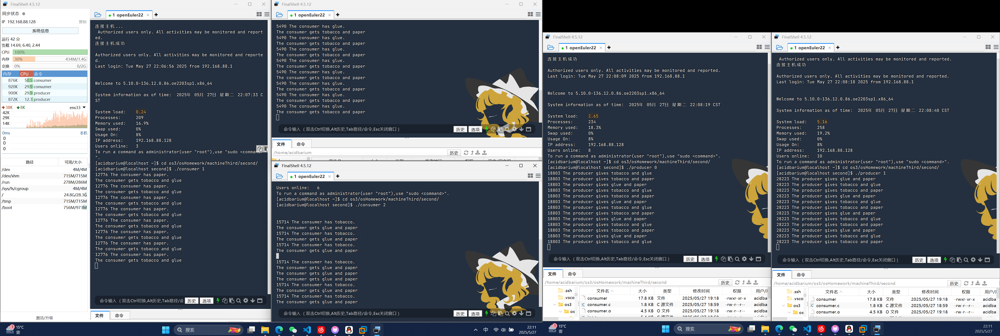

# 操作系统第三次次上机报告

班级：软件2306 学号：20232241110 姓名：刘晨旭

仓库地址：https://github.com/AcidBarium/osHomework

## 一、实验目的

1. 理解并掌握进程间通信（IPC）的基本原理和常用机制（共享内存、信号量）。
2. 熟悉生产者-消费者问题的同步与互斥实现方法。
3. 能够使用C语言编写基于IPC的多进程同步程序。


## 二、实验内容与原理

本实验通过实现生产者-消费者问题，演示了进程间通过共享内存和信号量进行同步与互斥的机制。

- **共享内存** 用于在生产者和消费者进程间传递数据（缓冲区）。
- **信号量** 用于实现对缓冲区的同步（空槽/产品数）和互斥（同一时刻只能有一个进程访问缓冲区）。

### 关键资源说明

- 缓冲区：大小为8字节的循环队列。
- 指针：生产者写指针、消费者读指针，均存储于共享内存。
- 信号量：
  - `prod_sem`：表示空槽数，生产者P操作，消费者V操作。
  - `cons_sem`：表示产品数，消费者P操作，生产者V操作。
  - `pmtx_sem`、`cmtx_sem`：互斥信号量，保护缓冲区的并发访问。

## 三、主要代码分析

### 1. 生产者进程（producer.c）

```c
/*
	Filename: producer.c
	Copyright: (C) 2006 by zhonghonglie
	Function: 模拟生产者进程，向共享缓冲区写入数据
*/
#include "ipc.h"
#include <unistd.h>

int main(int argc, char *argv[]) {
	int rate;
	// 通过命令行参数设置生产速率（默认3秒）
	if (argv[1] != NULL)
		rate = atoi(argv[1]);
	else
		rate = 3;

	// 共享内存相关配置
	buff_key = 101;     // 缓冲区共享内存键值
	buff_num = 8;       // 缓冲区大小（字节数）
	pput_key = 102;     // 生产者指针键值
	pput_num = 1;       // 指针数量
	shm_flg = IPC_CREAT | 0644; // 共享内存权限（读写）

	// 获取/创建共享内存（缓冲区和指针）
	buff_ptr = (char *)set_shm(buff_key, buff_num, shm_flg); // 缓冲区首地址
	pput_ptr = (int *)set_shm(pput_key, pput_num, shm_flg);  // 写指针地址

	// 信号量相关配置
	prod_key = 201;     // 生产者同步信号量键值
	pmtx_key = 202;     // 生产者互斥信号量键值
	cons_key = 301;     // 消费者同步信号量键值
	cmtx_key = 302;     // 消费者互斥信号量键值
	sem_flg = IPC_CREAT | 0644; // 信号量权限（读写）

	// 初始化信号量
	sem_val = buff_num; // 生产者同步信号量初值=缓冲区大小（可用空槽位数）
	prod_sem = set_sem(prod_key, sem_val, sem_flg); // 创建生产者同步信号量

	sem_val = 0;        // 消费者同步信号量初值=0（初始无产品可取）
	cons_sem = set_sem(cons_key, sem_val, sem_flg); // 创建消费者同步信号量

	sem_val = 1;        // 互斥信号量初值=1（保护缓冲区访问）
	pmtx_sem = set_sem(pmtx_key, sem_val, sem_flg); // 创建生产者互斥信号量

	// 持续生产数据
	while (1) {
		down(prod_sem);  // 等待空槽位（P操作）
		down(pmtx_sem);  // 进入临界区（P操作）

		// 模拟生产数据：写入字符（A+位置索引）
		buff_ptr[*pput_ptr] = 'A' + (*pput_ptr % 26); // 防止溢出ASCII范围
		sleep(rate); // 模拟生产耗时
		printf("%d producer put: %c to Buffer[%d]\n", getpid(), buff_ptr[*pput_ptr], *pput_ptr);

		// 更新写指针位置（循环缓冲区）
		*pput_ptr = (*pput_ptr + 1) % buff_num;

		up(pmtx_sem);  // 离开临界区（V操作）
		up(cons_sem);  // 通知消费者有新产品（V操作）
	}

	return EXIT_SUCCESS;
}
```

- 初始化共享内存和信号量。
- 主循环中，先P操作等待空槽，再P操作互斥信号量进入临界区，写入数据，更新写指针，最后V操作释放互斥和产品信号量。

### 2. 消费者进程（consumer.c）


```c
/*
	Filename: consumer.c
	Copyright: (C) 2006 by zhonghonglie
	Function: 模拟消费者进程，从共享缓冲区读取数据
*/
#include "ipc.h"
#include <unistd.h>

int main(int argc, char *argv[]) {
	int rate;
	// 通过命令行参数设置消费速率（默认3秒）
	if (argv[1] != NULL)
		rate = atoi(argv[1]);
	else
		rate = 3;

	// 共享内存相关配置
	buff_key = 101;     // 缓冲区共享内存键值
	buff_num = 8;       // 缓冲区大小（字节数）
	cget_key = 103;     // 消费者指针键值
	cget_num = 1;       // 指针数量
	shm_flg = IPC_CREAT | 0644; // 共享内存权限（读写）

	// 获取/创建共享内存（缓冲区和指针）
	buff_ptr = (char *)set_shm(buff_key, buff_num, shm_flg); // 缓冲区首地址
	cget_ptr = (int *)set_shm(cget_key, cget_num, shm_flg);  // 读指针地址

	// 信号量相关配置
	prod_key = 201;     // 生产者同步信号量键值
	pmtx_key = 202;     // 生产者互斥信号量键值
	cons_key = 301;     // 消费者同步信号量键值
	cmtx_key = 302;     // 消费者互斥信号量键值
	sem_flg = IPC_CREAT | 0644; // 信号量权限（读写）

	// 初始化信号量
	sem_val = buff_num; // 生产者同步信号量初值=缓冲区大小（可用空槽位数）
	prod_sem = set_sem(prod_key, sem_val, sem_flg); // 创建生产者同步信号量

	sem_val = 0;        // 消费者同步信号量初值=0（初始无产品可取）
	cons_sem = set_sem(cons_key, sem_val, sem_flg); // 创建消费者同步信号量

	sem_val = 1;        // 互斥信号量初值=1（保护缓冲区访问）
	cmtx_sem = set_sem(cmtx_key, sem_val, sem_flg); // 创建消费者互斥信号量

	// 持续消费数据
	while (1) {
		down(cons_sem);  // 等待缓冲区有产品（P操作）
		down(cmtx_sem);  // 进入临界区（P操作）

		sleep(rate); // 模拟消费耗时
		printf("%d consumer get: %c from Buffer[%d]\n", getpid(), buff_ptr[*cget_ptr], *cget_ptr);

		// 更新读指针位置（循环缓冲区）
		*cget_ptr = (*cget_ptr + 1) % buff_num;

		up(cmtx_sem);  // 离开临界区（V操作）
		up(prod_sem);  // 通知生产者有空槽位（V操作）
	}

	return EXIT_SUCCESS;
}

```

- 初始化共享内存和信号量。
- 主循环中，先P操作等待产品，再P操作互斥信号量进入临界区，读取数据，更新读指针，最后V操作释放互斥和空槽信号量。

### 3. IPC

```c
/*
	Filename: ipc.c
	Copyright: (C) 2006 by zhonghonglie
	Function: 实现 IPC 机制的核心函数
*/
#include "ipc.h"

// 全局变量声明（需在ipc.c中定义）
key_t buff_key;     // 缓冲区共享内存键值
int buff_num;       // 缓冲区大小（字节数）
char *buff_ptr;     // 缓冲区指针

// 生产者放产品位置的共享指针
key_t pput_key;     // 生产者指针键值
int pput_num;       // 指针数量
int *pput_ptr;      // 生产者指针

// 消费者取产品位置的共享指针
key_t cget_key;     // 消费者指针键值
int cget_num;       // 指针数量
int *cget_ptr;      // 消费者指针

// 信号量相关全局变量
key_t prod_key;     // 生产者同步信号量键值
key_t pmtx_key;     // 生产者互斥信号量键值
int prod_sem;       // 生产者同步信号量ID
int pmtx_sem;       // 生产者互斥信号量ID

key_t cons_key;     // 消费者同步信号量键值
key_t cmtx_key;     // 消费者互斥信号量键值
int cons_sem;       // 消费者同步信号量ID
int cmtx_sem;       // 消费者互斥信号量ID

int sem_val;        // 信号量初始值
int sem_flg;        // 信号量操作标志
int shm_flg;        // 共享内存操作标志

/*
	get_ipc_id() - 从/proc/sysvipc/文件系统中获取IPC对象的ID
	@proc_file: 对应的IPC文件路径（msg/sem/shm）
	@key: 要获取的IPC对象键值
*/
int get_ipc_id(char *proc_file, key_t key) {
	FILE *pf;
	int i, j;
	char line[BUFSZ], colum[BUFSZ];

	if ((pf = fopen(proc_file, "r")) == NULL) {
		perror("Proc file not open");
		exit(EXIT_FAILURE);
	}
	fgets(line, BUFSZ, pf); // 跳过首行标题

	while (!feof(pf)) {
		i = j = 0;
		fgets(line, BUFSZ, pf); // 读取数据行

		// 解析键值字段
		while (line[i] == ' ') i++;
		while (line[i] != ' ') colum[j++] = line[i++];
		colum[j] = '\0';

		if (atoi(colum) != key) continue; // 键值匹配检测

		// 提取IPC ID
		j = 0;
		while (line[i] == ' ') i++;
		while (line[i] != ' ') colum[j++] = line[i++];
		colum[j] = '\0';
		fclose(pf);
		return atoi(colum);
	}
	fclose(pf);
	return -1; // 未找到对应IPC对象
}

/*
	down() - 信号量P操作（阻塞）
	@sem_id: 信号量ID
*/
int down(int sem_id) {
	struct sembuf buf;
	buf.sem_op = -1;       // 减1操作
	buf.sem_num = 0;       // 信号量数组下标
	buf.sem_flg = SEM_UNDO; // 自动恢复机制

	if ((semop(sem_id, &buf, 1)) < 0) {
		perror("down error");
		exit(EXIT_FAILURE);
	}
	return EXIT_SUCCESS;
}

/*
	up() - 信号量V操作（释放）
	@sem_id: 信号量ID
*/
int up(int sem_id) {
	struct sembuf buf;
	buf.sem_op = 1;       // 加1操作
	buf.sem_num = 0;      // 信号量数组下标
	buf.sem_flg = SEM_UNDO; // 自动恢复机制

	if ((semop(sem_id, &buf, 1)) < 0) {
		perror("up error");
		exit(EXIT_FAILURE);
	}
	return EXIT_SUCCESS;
}

/*
	set_sem() - 创建/获取信号量并初始化
	@sem_key: 信号量键值
	@sem_val: 初始值
	@sem_flg: 权限标志
*/
int set_sem(key_t sem_key, int sem_val, int sem_flg) {
	int sem_id;
	Sem_uns sem_arg;

	// 检查信号量是否存在
	if ((sem_id = get_ipc_id("/proc/sysvipc/sem", sem_key)) < 0) {
		// 创建新信号量（1个元素）
		if ((sem_id = semget(sem_key, 1, sem_flg)) < 0) {
			perror("semaphore create error");
			exit(EXIT_FAILURE);
		}
		// 初始化信号量值
		sem_arg.val = sem_val;
		if (semctl(sem_id, 0, SETVAL, sem_arg) < 0) {
			perror("semaphore set error");
			exit(EXIT_FAILURE);
		}
	}
	return sem_id;
}

/*
	set_shm() - 创建/获取共享内存并附加
	@shm_key: 共享内存键值
	@shm_num: 内存大小（字节）
	@shm_flg: 权限标志
*/
char *set_shm(key_t shm_key, int shm_num, int shm_flg) {
	int i, shm_id;
	char *shm_buf;

	// 检查共享内存是否存在
	if ((shm_id = get_ipc_id("/proc/sysvipc/shm", shm_key)) < 0) {
		// 创建新共享内存
		if ((shm_id = shmget(shm_key, shm_num, shm_flg)) < 0) {
			perror("shareMemory set error");
			exit(EXIT_FAILURE);
		}
		// 附加到进程地址空间
		if ((shm_buf = (char *)shmat(shm_id, 0, 0)) < (char *)0) {
			perror("get shareMemory error");
			exit(EXIT_FAILURE);
		}
		for (i = 0; i < shm_num; i++) shm_buf[i] = 0; // 初始化为0
	} else {
		// 附加已有内存
		if ((shm_buf = (char *)shmat(shm_id, 0, 0)) < (char *)0) {
			perror("get shareMemory error");
			exit(EXIT_FAILURE);
		}
	}
	return shm_buf;
}

/*
	set_msq() - 创建/获取消息队列
	@msq_key: 队列键值
	@msq_flg: 权限标志
*/
int set_msq(key_t msq_key, int msq_flg) {
	int msq_id;

	// 检查消息队列是否存在
	if ((msq_id = get_ipc_id("/proc/sysvipc/msg", msq_key)) < 0) {
		// 创建新队列
		if ((msq_id = msgget(msq_key, msq_flg)) < 0) {
			perror("messageQueue set error");
			exit(EXIT_FAILURE);
		}
	}
	return msq_id;
}
```

```c
/*
	Filename: ipc.h
	Copyright: (C) 2006 by zhonghonglie
	Function: 声明 IPC 机制的函数原型和全局变量
*/
#include <stdio.h>
#include <stdlib.h>
#include <sys/types.h>
#include <sys/ipc.h>
#include <sys/shm.h>
#include <sys/sem.h>
#include <sys/msg.h>

#define BUFSZ 256  // 缓冲区大小

// 建立或获取IPC的一组函数的原型说明
int get_ipc_id(char *proc_file, key_t key);
char *set_shm(key_t shm_key, int shm_num, int shm_flag);
int set_msq(key_t msq_key, int msq_flag);
int set_sem(key_t sem_key, int sem_val, int sem_flag);
int down(int sem_id);  // 信号量P操作
int up(int sem_id);    // 信号量V操作

/* 信号灯控制用的共同体 */
typedef union semuns {
	int val;  // 信号量值
} Sem_uns;

/* 消息结构体 */
typedef struct msgbuf {
	long mtype;       // 消息类型，必须大于0
	char mtext[1];    // 消息数据（长度可变）
} Msg_buf;

// 全局变量声明（需在ipc.c中定义）
extern key_t buff_key;     // 缓冲区共享内存键值
extern int buff_num;       // 缓冲区大小（字节数）
extern char *buff_ptr;     // 缓冲区指针

// 生产者放产品位置的共享指针
extern key_t pput_key;     // 生产者指针键值
extern int pput_num;       // 指针数量
extern int *pput_ptr;      // 生产者指针

// 消费者取产品位置的共享指针
extern key_t cget_key;     // 消费者指针键值
extern int cget_num;       // 指针数量
extern int *cget_ptr;      // 消费者指针

// 信号量相关全局变量
extern key_t prod_key;     // 生产者同步信号量键值
extern key_t pmtx_key;     // 生产者互斥信号量键值
extern int prod_sem;       // 生产者同步信号量ID
extern int pmtx_sem;       // 生产者互斥信号量ID

extern key_t cons_key;     // 消费者同步信号量键值
extern key_t cmtx_key;     // 消费者互斥信号量键值
extern int cons_sem;       // 消费者同步信号量ID
extern int cmtx_sem;       // 消费者互斥信号量ID

extern int sem_val;        // 信号量初始值
extern int sem_flg;        // 信号量操作标志
extern int shm_flg;        // 共享内存操作标志
```

- 提供了共享内存、信号量、消息队列的创建、获取和操作函数。
- 封装了P/V操作、共享内存附加、信号量初始化等底层细节。

## 五、实验流程

1. 编译所有源文件，生成可执行文件。
2. 分别启动生产者和消费者进程，可通过命令行参数调整生产/消费速率。
3. 观察终端输出，验证生产者和消费者对缓冲区的同步与互斥访问。

## 六、实验结果

- 生产者和消费者进程能够正确地交替访问缓冲区，数据不会丢失或重复。
- 缓冲区不会出现越界访问，且不会发生死锁。
- 通过调整速率参数，可以观察到缓冲区的动态变化和同步效果。


如图所示，4个进程有序地进行生产和消费的模拟


## 抽烟者问题


### consume.c
```c
#include "ipc.h"
int main(int argc, char *argv[])
{
    int rate = 3;
    int consumerid = atoi(argv[1]);
    buff_h = 101;
    buff_number = 8;
    cget_h = 103;
    cget_number = 1;
    shm_flg = IPC_CREAT | 0644;
    buff_ptr = (char *)set_shm(buff_h, buff_number, shm_flg);
    cget_ptr = (int *)set_shm(cget_h, cget_number, shm_flg);
    prod_h = 201;
    pmtx_h = 202;
    cons_h = 301;
    cmtx_h = 302;
    sem_flg = IPC_CREAT | 0644;
    sem_val = buff_number;
    prod_sem = set_sem(prod_h, sem_val, sem_flg);
    sem_val = 0;
    cons_sem = set_sem(cons_h, sem_val, sem_flg);
    sem_val = 1;
    cmtx_sem = set_sem(cmtx_h, sem_val, sem_flg);
    if (consumerid == 0)
        *cget_ptr = 0;
    while (1)
    {
        if (buff_ptr[0] - 'A' == consumerid)
        {
            down(cons_sem);
            down(cmtx_sem);
            sleep(rate);
            if (buff_ptr[0] == 'A')
            {
                printf(
                    "%d The consumer has glue.\nThe consumer gets tobacco and "
                    "paper\n",
                    getpid());
            }
            if (buff_ptr[0] == 'B')
            {
                printf(
                    "%d The consumer has paper.\nThe consumer gets tobacco and "
                    "glue\n",
                    getpid());
            }
            if (buff_ptr[0] == 'C')
            {
                printf(
                    "%d The consumer has tobacco.\nThe consumer gets glue and "
                    "paper\n",
                    getpid());
            }
            *cget_ptr = (*cget_ptr + 1);
            if (*cget_ptr % 2 == 0)
                buff_ptr[0] = 'D';
            else
                buff_ptr[0] = 'E';
            up(cmtx_sem);
            up(prod_sem);
        }
    }
    return EXIT_SUCCESS;
}

```


这段代码实现了基于共享内存和信号量机制的消费者进程。程序通过 `buff_ptr` 共享内存存放资源标识符，`cget_ptr` 共享内存记录已消费次数。每个消费者进程在运行时依据启动参数 `consumerid` 判断是否轮到自己消费。当检测到缓冲区中的资源类型与自身标识匹配时，消费者通过 `down` 操作申请消费者信号量与互斥信号量，进入临界区，模拟消费过程，输出相应信息，并更新消费计数。当消费计数为偶数时，将缓冲区标识设置为 'D'，否则设置为 'E'，表示消费完成，并指定下一个生产者。随后释放互斥信号量和生产者信号量，通知生产者进程可以继续生产。该进程持续循环执行上述操作，实现多进程环境下对共享资源的同步访问与互斥控制。




如图所示，五个进程，两个提供者和三个抽烟者都能够正常地运行。

### producer.c
```c
#include "ipc.h"
int main(int argc, char *argv[])
{
    int rate = 3;
    int producerid = atoi(argv[1]);
    buff_h = 101;
    buff_number = 8;
    pput_h = 102;
    pput_number = 1;
    shm_flg = IPC_CREAT | 0644;
    buff_ptr = (char *)set_shm(buff_h, buff_number, shm_flg);
    pput_ptr = (int *)set_shm(pput_h, pput_number, shm_flg);
    prod_h = 201;
    pmtx_h = 202;
    cons_h = 301;
    cmtx_h = 302;
    sem_flg = IPC_CREAT | 0644;
    sem_val = buff_number;
    prod_sem = set_sem(prod_h, sem_val, sem_flg);
    sem_val = 0;
    cons_sem = set_sem(cons_h, sem_val, sem_flg);
    sem_val = 1;
    pmtx_sem = set_sem(pmtx_h, sem_val, sem_flg);
    if (producerid == 0)
    {
        buff_ptr[0] = 'D';
        *pput_ptr = 0;
    }
    while (1)
    {
        if (buff_ptr[0] - 'D' == producerid)
        {
            down(prod_sem);
            down(pmtx_sem);
            *pput_ptr = (*pput_ptr + 1) % 3;
            if (*pput_ptr == 0)
            {
                buff_ptr[0] = 'A';
                printf("%d The producer gives tobacco and paper\n", getpid());
            }
            if (*pput_ptr == 1)
            {
                buff_ptr[0] = 'B';
                printf("%d The producer gives tobacco and glue\n", getpid());
            }
            if (*pput_ptr == 2)
            {
                buff_ptr[0] = 'C';
                printf("%d The producer gives glue and paper\n", getpid());
            }
            sleep(rate);
            up(pmtx_sem);
            up(cons_sem);
        }
    }
    return EXIT_SUCCESS;
}

```

基于共享内存和信号量机制的生产者进程。程序通过 `buff_ptr` 共享内存用于放置资源标识符，通过 `pput_ptr` 共享内存记录已投放次数。每个生产者进程根据启动参数 `producerid` 判断是否轮到自己投放资源。当缓冲区中的标识值减去 'D' 后等于自身 `producerid` 时，生产者通过 `down` 操作申请生产者信号量和互斥信号量，进入临界区，更新资源投放计数。根据计数值选择性地向缓冲区投放不同组合的资源（以 'A'、'B'、'C' 表示），输出相应信息，并暂停指定时间模拟投放过程。随后释放互斥信号量和消费者信号量，通知消费者进程可以取用资源。该进程循环执行上述操作，实现多进程环境下对共享资源的同步控制与互斥访问。


## 七、实验总结

本次实验通过实现经典的生产者-消费者问题，深入理解了进程间通信（IPC）机制，掌握了共享内存和信号量的基本用法与同步互斥原理。生产者和消费者通过共享内存中的缓冲区实现数据交换，利用信号量保证对缓冲区的有序访问与同步，解决了多进程并发操作中的冲突问题。实验加深了对操作系统进程通信机制的理解，也提升了多进程编程与同步控制的实践能力。

